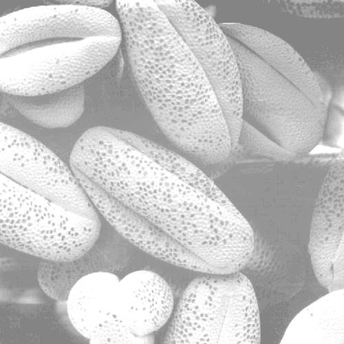
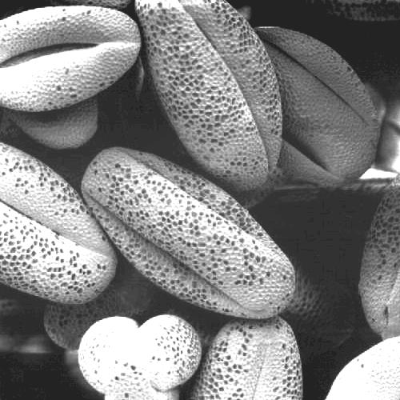
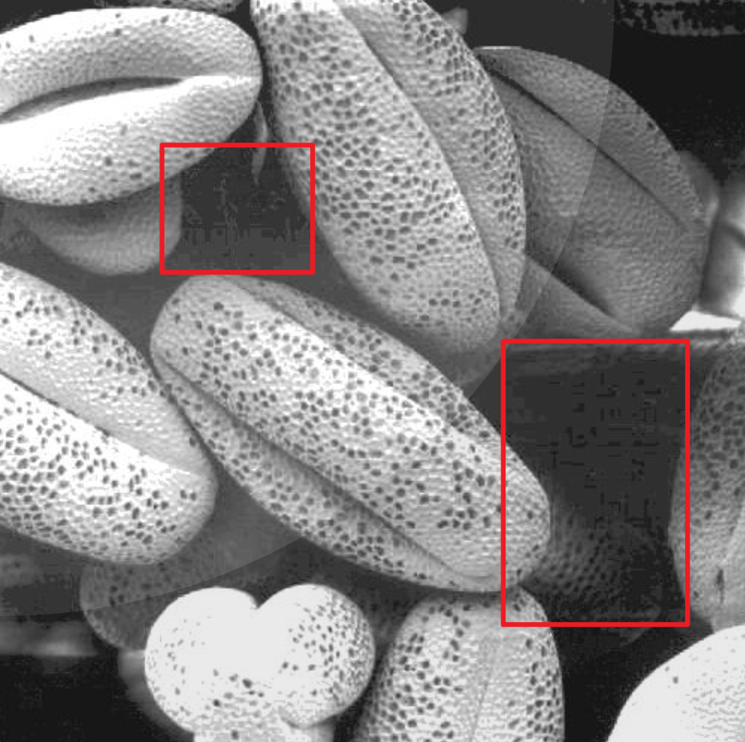
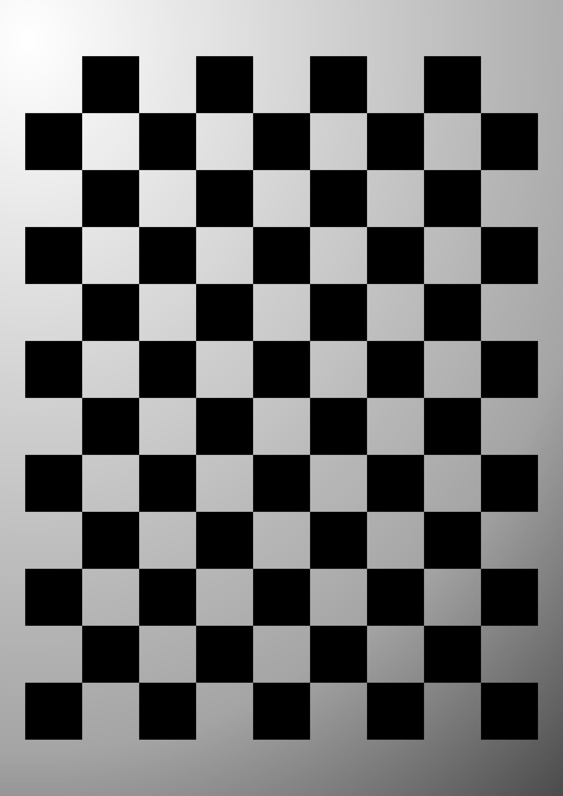
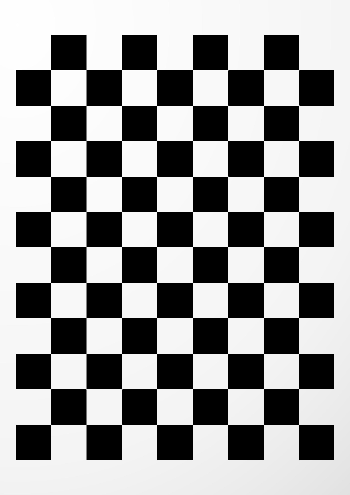
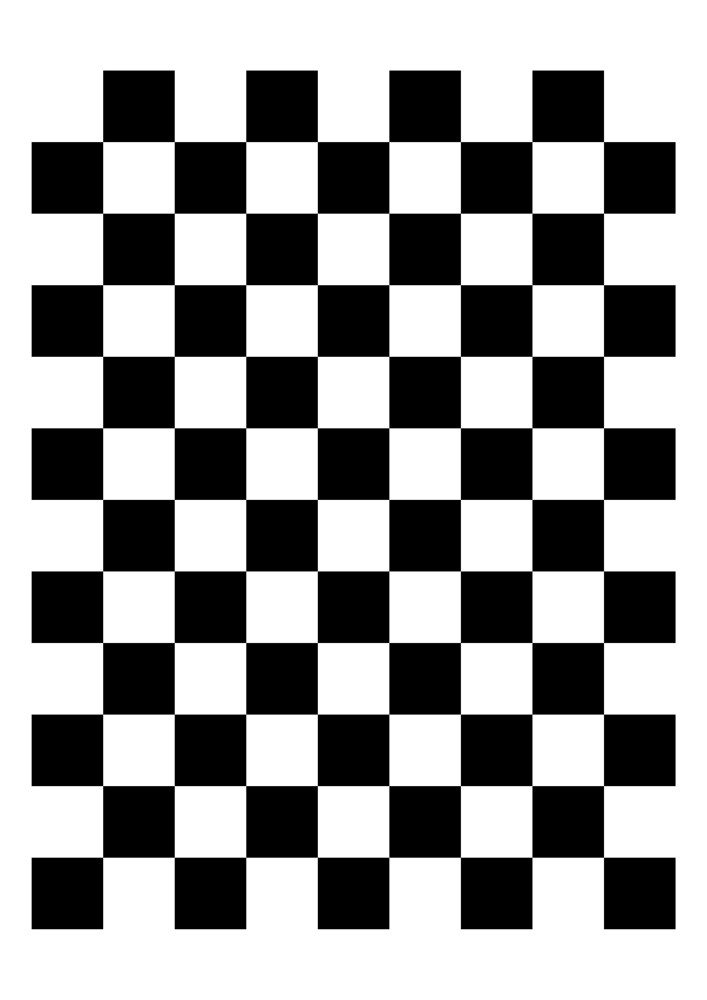

# Coding Test Report

> SID: 12112619
>
> Name: 黄亭钧

## Enhancing Over-exposure Image

The first testing image in the test is shown below:



After investigating this image, we can easily notice that the problem with this image is that it is over-exposed.

So, the first solution to this problem without using histogram equalization is **Gamma Transformations**. The code for Gamma Transformations is shown below:

```python
def gamma(image, gamma):
    # 0-255 -> 0-1
    image_normalized = image.astype(np.float64) / 255.0
    image_gamma = image_normalized ** gamma
    # 0-1 -> 0-255
    image_gamma_out = (image_gamma * 255).astype(np.uint8)
    return image_gamma_out
```


Since we need to pull down the bright part of the image more violently, I chose the gamma value as **3**. The resultant image is shown below:



This does a good job of enhancing the image, even outperforming the histogram equalization method in some aspects. For example, histogram equalization usually introduces some fake textures as shown in the following figure.



Another method of enhancing the image is by normalizing, the code for which is shown below:

```python
def normalize(image):
    image_enhanced = image.copy()
    image_enhanced = image_enhanced - np.min(image_enhanced)
    image_enhanced = image_enhanced / np.max(image_enhanced) * 255
    image_enhanced = image_enhanced.astype(np.uint8)
    return image_enhanced
```

The result is also good and the method doesn’t introduce fake textures as shown in the following figure:


## Lighting Equalization

In the second question, the input image is shown below:



In this figure, the upper-left corner is better lit, while the lower-right corner is dimly lit. 

Similarly, we can also use **Gamma Transformations** to process this image, but this time we need to set the gamma value less than 1 to enhance the dim part violently while not improving the bright part a lot. In this experiment, I chose the gamma value of **0.1**. The resultant image is shown below:




We also notice that the input image is in the form of a chess grid, so besides using gamma transformation, we can also use binarization. The code for this is shown below:

```python
def binarize(image, threshold):
    image_binarized = image.copy()
    image_binarized[image_binarized < threshold] = 0
    image_binarized[image_binarized >= threshold] = 255
    return image_binarized
```

With a threshold of **50**, we can obtain the binarized image shown below:

