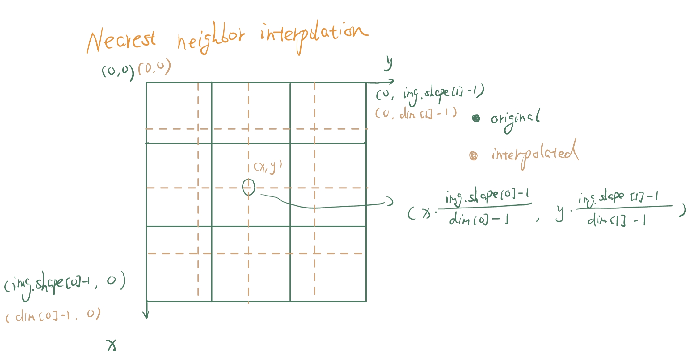
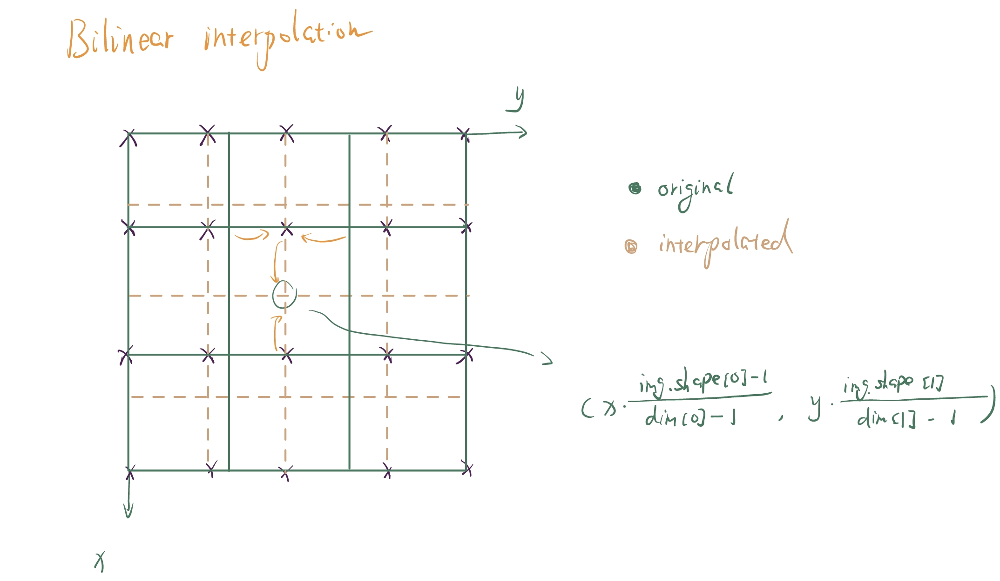
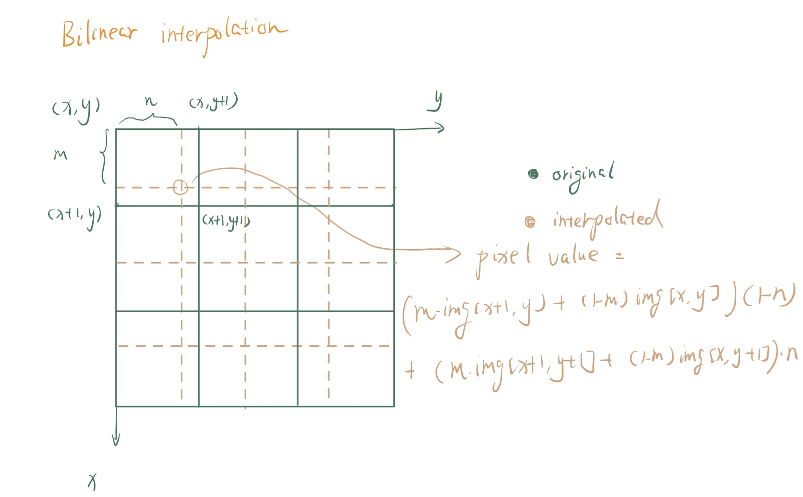
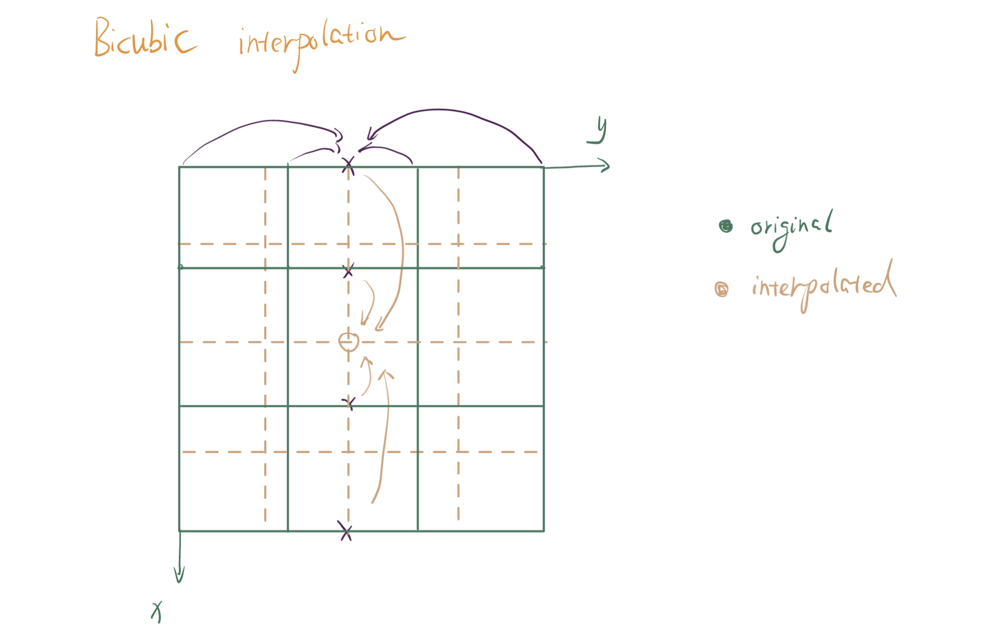
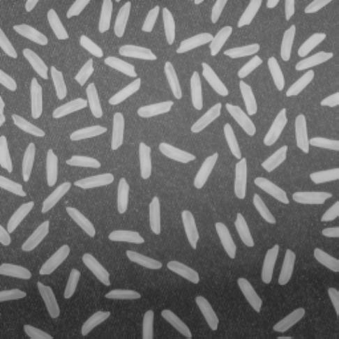

# Image Interpolation

# 1 Introduction

In this lab, we delve into the topic of image interpolation. Specifically, three kinds of image interpolation methods are mainly introduced, i.e., nearest neighbor interpolation, bilinear interpolation, and bicubic interpolation. These three kinds of interpolation methods all involve pixel index mapping. During the experiment, I found inverse mapping, which maps the pixel index in the interpolated image to the original image, is easier and more intuitive. So, I mainly use this mapping method. The results of interpolation are satisfying, which yields the expected effect on the image.

Keywords: nearest neighbor interpolation; bilinear interpolation; bicubic interpolation; index mapping

# 2 Method

## 2.1 Nearest Neighbor Interpolation

Nearest neighbor interpolation is perhaps the most straightforward and also the fastest interpolation method.  The most important part of the nearest neighbor interpolation is pixel mapping. As shown in figure ref, the index of the interpolated image (in brown) can be mapped into the index of the original image (in green). **Note that the grid points represent pixels.**



As for the value assignment for the interpolated image, consider the following procedure: 

1. Get the inverse mapping index of the interpolated image in the original image.

2. Round off the x and y indexes or coordinates and get the integer indexes.

3. Assign the pixel of the interpolated image with the value where the pixel of the same integer indexes in the original image.

## 2.2 Bilinear Interpolation

Bilinear interpolation is a better choice of image interpolation method if we want the interpolated image to be smooth rather than edgy. The naive method for bilinear interpolation is that we can first interpolate along one of the axes and then interpolate along the other.

The basic method is shown in figure ref.

1. Interpolate along the y-axis to obtain the intermediate value of the grid points marked `x` in purple.
2. Then interpolate along the x-axis to obtain the exact value of the grid points of the interpolated image.



### Extension: Alternative Way for Bilinear Interpolation

Suppose we delve deeper into the pixel assignment of the interpolated image. In that case, we can find out that the pixel’s value of the interpolated image only associates with the four neighbors of the original image. So, we may ask, since it is bilinear, is there a way to assign an interpolated pixel with only the weighted values of those four neighbors? The answer is yes.

As shown in Figure ref, we can use the formula in this figure to obtain the exact value of the interpolated pixel directly from the four neighbors. Parameters `m` and `n` can be easily derived from the mapped indexes of interpolated pixels.



## 2.3 Bicubic Interpolation

Bicubic interpolation is the most difficult of the three interpolation methods. The hardest part is that we need at most $4\times4=16$​ pixels from the original image to obtain only one pixel of the interpolated image. We also need to consider that there are not enough pixels from the original image at the edge of the interpolated image for us to do cubic regression. My solution is as follows, though it may seem inefficient.

As shown in Figure ref, to obtain the pixel value of the center pixel marked `o`, we need first to use cubic regression to interpolate the intermediate pixel values marked `x` along the y-axis, then use these intermediate pixel values to interpolate along the x-axis.



As for the pixels close to the image edges, I flip the image along the edges to fill up the “outside pixels”. This can be easily done in coding by flipping the index of those out of the bound.

# 3 Experiment

Note: The testing image for this section is Figure ref.


## 3.1 Nearest Neighbor Interpolation

The implementation of the nearest neighbor interpolation can be expressed in the following pseudo code: 

``` python
# read the original image
img = read_img(original_img)
# create a zero image array
out_img.initialized(size = interpolated_dim[0],interpolated_dim[1])
# traverse all the interpolated pixels
for x, y in out_img:
	# inverse mappping
	x1 = inverse_mapping(x)
	y1 = inverse_mapping(y)

	#find the index of the nearest neighbor
	x2 = round(x1)
	y2 = round(y1)
	
	#pixel assignment
	out_img[x,y] = img[x2,y2]
return out_img
	
```

**In particular, the inverse_mapping() of three kinds of interpolation is the same.** If written in `Python` language, it should look like this:

```python
x1 = x * (img.shape[0]-1) / (dim[0] - 1)
y1 = y * (img.shape[1]-1) / (dim[1] - 1)
```


Since the `round()` function in `Python` is already searching for the nearest integer, we need not write another function to do this.

The output image of the nearest neighbor interpolation looks something like Figure ref.


## 3.2 Bilinear Interpolation

In this part, since I have written two implementations for this method, so there are two parts in this section.

### 3.2.1 First Approach

The first implementation of bilinear interpolation can be expressed in the following pseudo-code, which performs two times linear interpolation:

```python
# read the original image
img = read_img(original_img)
# create a zero image array
out_img.initialized(size = (interpolated_dim[0],interpolated_dim[1]))
# create an intermediate image array
tmp.initialized(img.shape[0],interpolated_dim[1])

# first interpolate along the y-axis
for i,j in tmp:
    y = inverse_mapping(j)
    y1 = floor(y1)
    tmp[i,j] = linear_interp(img[i,y1],img[i,y1+1],y)

# then interpolate along the x-axis
for i, j in out_img:
    x = inverse_mapping(i)
    x1 = floor(x1)
    out_img[i,j] = linear_interp(img[x1,j],img[x1+1,j],x)

returm out_img
```

The `floor()` function returns the lower integer bound of the input value.

And the `linear_interp()` function written in `Python` looks something like this:

```python
if x1 == img.shape[0]-1:
    x1 -= 1
out_img[i,j] = tmp[x1,j] + (x-x1)*(tmp[x1+1,j]-tmp[x1,j])
```

Note that the first two lines of boundary detection are necessary.

The result of this implementation looks something like Figure ref.


### 3.2.2 Second Approach

The second approach of bilinear interpolation directly computes the output pixel value by using the four neighbors’ values. The pseudo-code of this implementation is as follows.

```python
# read the original image
img = read_img(original_img)
# create a zero image array
out_img.initialized(size = (interpolated_dim[0],interpolated_dim[1]))

for x,y in out_img:
    x1, y1 = inverse_mapping(x,y)
    m,n = calculate_weight_from_index(x1,y1)
    out_img[x,y] = weighted_neighbor_value(x1,y1,m,n)
return out_img
```

In particular, the `calculate_weight_from_index()` function does the following jobs. The code is written in `Python`.

```python
x1 = x * (img.shape[0]-1) / (dim[0] - 1)
x2 = math.floor(x1)
m = x1 - x2
y1 = y * (img.shape[1]-1) / (dim[1] - 1)
y2 = math.floor(y1)
n = y1 - y2
```

And the `weighted_neighbor_value()` function calculates the final pixel’s value:

```python
out_img[x, y] = (1-n) * (m * img[x2+1,y2] + (1-m) * img[x2,y2])+ n * (m * img[x2+1,y2+1] + (1-m)*img[x2,y2+1])
```

The resulting interpolated image of this approach looks something like Figure ref, which is the same as Figure ref.



## 3.3 Bicubic Interpolation

The pseudo-code for bicubic interpolation is as follows:

```python
# read the original image
img = read_img(original_img)
# create a zero image array
out_img.initialized(size = (interpolated_dim[0],interpolated_dim[1]))
# create an intermediate image array
tmp.initialized(interpolated_dim[0],img.shape[1])

# first interpolate along x-axis
for x, y in tmp:
    x1 = inverse_mapping(x)
    sample_x = [floor(x1)-1,floor(x1),floor(x1)+1,floor(x1)+2]
    sample_y = find_pixel_value_of_sample_x(flip_if_needed(sample_x))
    cubic_func = fit_cubic_function(sample_x,sample_y)
    tmp[x, y] = cubic_func(x1)

# then interpolate along y-axis
for x, y in out_img:
    y1 = inverse_mapping(y)
    sample_y = [floor(y1)-1,floor(y1),floor(y1)+1,floor(y1)+2]
    sample_x = find_pixel_value_of_sample_y(flip_if_needed(sample_x))
    cubic_func = fit_cubic_function(sample_x,sample_y)
    out_img[x, y] = cubic_func(y1)

return out_img
```

The `flip_if_needed()` function can handle the case that the requested index of the original pixel is out of bounds. It looks something like this if written in `Python` code:

```python
# find the nearest orginial pixel index
m = np.array([np.floor(x1)-1, np.floor(x1), np.floor(x1)+1, np.floor(x1)+2])
m_tmp = m.copy()
m_tmp[m_tmp < 0] = np.abs(m_tmp[m_tmp < 0])
m_tmp[m_tmp >= img.shape[0]] = 2*img.shape[0] - m_tmp[m_tmp >= img.shape[0]] - 1
m_tmp = m_tmp.astype(int)
```

And I fit a cubic function using the `polyfit` and `poly1d` function in `numpy`,  which in code are something like this:
```python
coefficients = np.polyfit(m, n, 3)
poly = np.poly1d(coefficients)
tmp[x, y] = poly(x1)
```

Here, `m` and `n` are the `sample_x` and `sample_y` in the pseudo-code.

The resulting image of bicubic interpolation is Figure ref.


# 4 Result Analysis

From the above Figure ref to Figure ref, we can intuitively understand these three interpolation methods.

For nearest neighbor interpolation, the edgy effect is because nearby pixels in the interpolated image can be assigned to different neighbors in the original image, and this causes the neighbor of the interpolated image to have mutated values.

For bilinear interpolation, since it considers the linear change in both directions, the interpolated image should have a smooth transition from pixel to pixel. However, this can also make the output image look blurry.

For bicubic interpolation, it considers more nearby pixels during the interpolation process to capture the inner nature of change of the original image, giving the interpolated image a sharper outline.

To better compare the efficiency of all of the above interpolations as well as a `scipy` implemented bicubic interpolation, I do a timing benchmark, the result is as follows:

```python
Nearest: 0.17167043685913086 seconds.
Bilinear type1: 0.12122154235839844 seconds.
Bilinear type2: 1.1743693351745605 seconds.
Bicubic: 16.160951852798462 seconds.
Bicubic Scipy: 0.00809168815612793 seconds.
```

The bicubic interpolation I wrote is the slowest, which is in accord with my expectation because it involves so many regressions. And since `scipy` is a library highly optimized for science computation, it should have the best record.

However, I expected the bilinear interpolation in section 3.2.1 to be less efficient than the one in section 3.2.2, because the first approach involves 2 `for` loops while the second approach only involves 1 `for` loop, while the timing benchmark is against my intuition. So I tried to do some simple ablation study.

I found that if I comment out all the pixel assignment statements, approach 2 runs faster than approach.

```python
Bilinear type1: 0.11931777000427246 seconds.
Bilinear type2: 0.08695650100708008 seconds.
```

 Hence, the bottleneck of approach 2 is this statement:

```python
out_img[x, y] = (1-n) * (m * img[x2+1,y2] + (1-m) * img[x2,y2])+ n * (m * img[x2+1,y2+1] + (1-m)*img[x2,y2+1])
```

I guess that this statement runs so slowly due to the nature of memory, which means the process of accessing those pixel values in array `img` is not continuous.

# 5 Conclusion

In this lab, we explore three types of interpolation methods: nearest neighbor interpolation, bilinear interpolation, and bicubic interpolation. We first analyze the mathematic derivation of these interpolation methods. Then, we analyze the interpolation effects by looking into the images these interpolation methods produced and finding the root of these differences. Finally, we do a timing benchmark of this method and discover the efficiency difference between these methods. In particular, we try two implementations of bilinear interpolation, distinguishing their efficiency difference.
