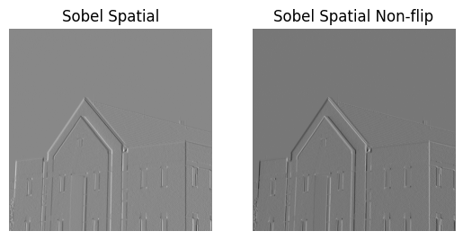
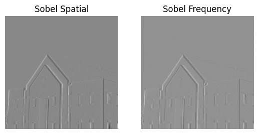
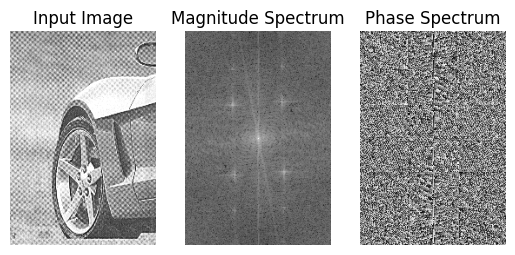
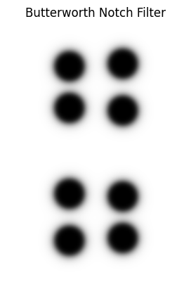
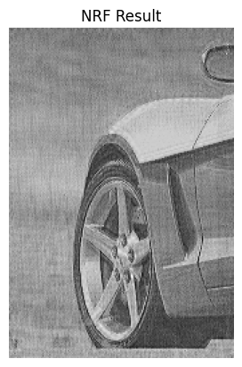
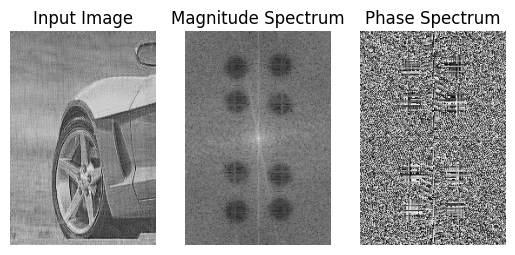
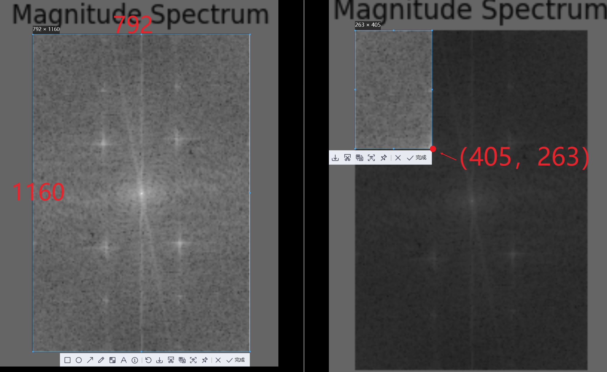

# Frequency Domain Filtering

# Introduction

In this lab, we delved into the frequency domain filtering technique while also comparing it with spatial filtering. Specifically, we first investigate the Sobel filtering in both the spatial domain and the frequency domain. Next, we perform a Butterworth notch filtering individually in the frequency domain, which involves a great deal of steps needed to pay attention to.

# Sobel Filtering

## In Spatial Domain

To perform Sobel filtering to an image in the spatial domain, we can directly perform 2D convolution.

First, flip the Sobel kernel using the following code:
```python
kernel = np.flipud(np.fliplr(kernel))
```

This step is really often omitted because a spatial kernel is usually symmetric, however, this is not the case for a Sobel kernel, which is a kernel in the form of this:
$$
\begin{bmatrix}
-1&0&1\\
-2&0&2\\
-1&0&1
\end{bmatrix}
$$
As we can see, this kernel is not symmetric. Thus, the flipping is necessary in this case; if we don’t perform this step, the output image can have a different changing direction of the texture, as shown in Figure todo.

Next, multiply, add, and slide the kernel, and then we can obtain the desired image filtered by the Sobel spatial kernel.



The code for spatial filtering is shown below:

```python
def sobel_spatial(img: np.ndarray, flipping = True):
    sobel_y = np.array([[-1, 0, 1], [-2, 0, 2], [-1, 0, 1]])
    if flipping:
        mask_y = conv2d(img, sobel_y, stride=1, padding=1,flipping=True)
    else:
        mask_y = conv2d(img, sobel_y, stride=1, padding=1,flipping=False)
    return mask_y

def conv2d(img: np.ndarray, kernel: np.ndarray, stride: int = 0, padding: int = 0, flipping =True) -> np.ndarray:
    temp = np.pad(img, padding, mode='reflect')
    if flipping:
        kernel = np.flipud(np.fliplr(kernel))
    out_img = np.zeros(img.shape)
    for i in range(0, img.shape[0], stride):
        for j in range(0, img.shape[1], stride):
            out_img[i, j] = np.sum(temp[i:i+kernel.shape[0], j:j+kernel.shape[1]] * kernel)
    return out_img
```

## In Frequency Domain

Performing frequency domain filtering is much trickier than spatial domain. Since we can only perform Discrete Fourier Transform (DFT) to an image or kernel in a digital computer, and the spectrum of DFT (or its fast implementation version: FFT) is sampled from a full Fourier spectrum, which can cause wrap-around error if we don’t pad zeros to the image and the kernel before doing frequency domain filtering.

First, we need to pad the image and the kernel to a suitable size, which means if the image is of size $H\times W$, and the kernel is of size $m\times n$, then we need to pad both the image and the kernel to size $(H+m-1)\times (W+n-1)$. Note that, we pad zeros in the direction along the positive direction of two axes, which can preserve the position of the image after filtering.

Then, do FFT2 to both the padded image and the padded kernel, and multiply them in the frequency domain.

Next, IFFT2 is performed, and the imaginary part of the image is set to zero to deal with the parasitic imaginary part.

Finally, crop the image to the original size.

The code for the frequency domain filtering is shown below:

```python
def sobel_freq(img: np.ndarray):
    sobel = pad_sobel(int(img.shape[0]-1), int(img.shape[1])-1)
    img_pad = np.pad(img, ((0, 2), (0, 2)), mode='constant', constant_values=0)
    X_img = np.fft.fft2(img_pad)
    H_sobel = np.fft.fft2(sobel)
    Y_img = X_img * H_sobel
    y_img = np.fft.ifft2(Y_img)
    y_img = np.real(y_img)
    y_img = y_img[0:-2, 0:-2]
    plt.figure()
    plt.subplot(1,2,1)
    plt.imshow(sobel, cmap='gray')
    plt.axis('off')
    plt.title('Sobel Filter')
    plt.subplot(1,2,2)
    plt.imshow(img_pad, cmap='gray')
    plt.axis('off')
    plt.title('Padded Image')
    plt.show()
    return y_img

def pad_sobel(padding_x: int = 1, padding_y: int = 1):
    sobel_y = np.array([[-1, 0, 1], [-2, 0, 2], [-1, 0, 1]])
    sobel_y = np.pad(sobel_y, ((0, padding_x), \
                    (0, padding_y)), mode='constant', constant_values=0)
    return sobel_y
```


The spatial and frequency domain filtering results are almost the same as shown in Figure todo.



Except for the black edge in the frequency domain filtered results, which is because we pad the image in spatial convolution in `reflect` mode.

```python
def conv2d(...):
    ...
	temp = np.pad(img, padding, mode='reflect')
	...
```

## Remarks

In the textbook, the author performs the frequency domain filtering differently as shown below:

> Generating $H(u,v)$
>
> 1. Multiply $h_p(x,y)$ by $(-1)^{x+y} $​ to center the frequency domain filter 
> 2. Compute the forward DFT of the result in (1) 
> 3. Set the real part of the resulting DFT to 0 to account for parasitic real parts 
> 4. Multiply the result by $(-1)^{u+v} $ which is implicit when $ h_p(x,y) $ was moved to the center of $ H(u,v) $.

The first step, centering the kernel, is not necessary for computation but is good for visualization of the spectrum.

In the fourth step, which multiplies the frequency spectrum of $h_p(x, y)$ with $(-1)^{u+v}$ , the author intends to move the spatial kernel which is padded to the center back to the corner. The author padded the kernel to the center first because making the padded kernel odd-symmetric can have a special effect of preserving the image phase, which is important for image information preservation. 

But I still doubt this step is necessary if I don’t need to pad the kernel to center at the beginning.

# Butterworth Notch Filter

Sometimes, there is some noise in the image, which exhibits a periodic fashion; we can use a Butterworth notch filter to deal with this situation.

As shown in Figure todo, we notice a periodic grid pattern in the image. If we do an FFT2 to this image, the magnitude spectrum shows eight bright spots separated around the central bright pattern. And those eight bright spots are the noise.



To filter out this noise, we need to use a notch filter because no matter whether it is a low pass filter, high pass filter, or bandpass filter, all centered at the middle of the spectrum, it is impossible to filter out the noise without affecting the main information of the image.

Using a Butterworth filter instead of an ideal filter is because an ideal notch filter can impose a significant ring effect, which can be eliminated by choosing a Butterworth notch filter. 

The frequency spectrum of this filter is shown in Figure todo. 

The result after filtering is shown in Figure todo.





If we do the FFT2 to the filtered result (Figure todo), we can notice that the noise in the spectrum has been filtered out.



The code performing Butterworth notch filter is shown below:

```python
def butter_notch(D0k: list, img: np.ndarray, uk: list, vk: list ,order: int = 4, scale = True):
    assert len(D0k) == len(uk) == len(vk), 'Invalid input. # of D0k, uk, vk should be the same.'
    img_pad = np.pad(img, ((0,img.shape[0]), (0,img.shape[1])), mode= 'constant', constant_values=0)
    X_img = np.fft.fft2(img_pad)
    X_img = np.fft.fftshift(X_img)

    uu,vv = np.ogrid[0:X_img.shape[0], 0:X_img.shape[1]]

    Dk = []
    D_k = []
    H = np.ones(X_img.shape)

    if scale:
        uk = [u * X_img.shape[0] for u in uk]
        vk = [v * X_img.shape[1] for v in vk]

    for k in range(len(D0k)):
        dk = np.sqrt((uu-uk[k])**2 + (vv -vk[k])**2)
        d_k = np.sqrt((uu-(X_img.shape[0]-uk[k]))**2 + (vv - (X_img.shape[1]-vk[k]))**2)
        H = H * (1/(1+(D0k[k]/dk)**(2*order))) * (1/(1+(D0k[k]/d_k)**(2*order)))
    Y_img = X_img * H
    Y_img = np.fft.ifftshift(Y_img)
    y_img = np.fft.ifft2(Y_img)
    y_img = np.real(y_img)
    y_img = y_img[0:img.shape[0], 0:img.shape[1]]
    return y_img
```

## Remarks

In the definition of the function performing Butterworth notch filter, there are several parameters we need to determine beforehands.

```python
def butter_notch(D0k: list, img: np.ndarray, uk: list, vk: list ,order: int = 4, scale = True):
```

- `D0k`: a list of length `k`, every element in the list is the radius of each notch in the spectrum.
- `uk`, `vk`: both of length `k`, $(uk, vk)$ is the center of each notch
- `order`: order of the Butterworth filter
- `scale`: if `True`, it means that the input $(uk, vk)$ is expressed in scale(i.e. $uk/img.shape[0]$ and $vk/ung,shape[1]$)


For `D0k`, we should not set it too large or too small. If it is too large, noise and the useful information in the image will be filtered out. If it is too small, we cannot effectively filter out the noise. I chose D0k=30(pixels) and found that it works pretty well.

After setting `scale=True`, we can find the `uk` and `vk` by using the snipping tool which can help us to determine the position of the bright spot as shown in Figure todo.



Although I have tried to use some image processing methods to find the position of those bright spots, I failed because there is also a lot of unstructured bright noise in this spectrum. So even after using some filtering techniques, it is still hard to determine the exact positions of those bright spots.

However, the “snipping method” seems rough, it works well for this example.

For the order parameter, I use the default value of 4, which is enough to filter out the noise. If `order` is too large, there may exist ring effect because it behaves more like an ideal filter. If `order` is too small, the filtering effect is weak.

Note that I chose the filter shown in Figure todo be real and symmetric, which is significant if we directly perform filtering solely in the frequency domain (just as indicated **on Slide 69 of Lecture 4**). The filter needs to be symmetric because it corresponds to a real spatial kernel, and we can only perform convolution for an image of real value and a kernel of real value. The filter needs to be symmetric because by doing this, we can ensure the filter is zero-phase and will not change the fundamental information of an image since the phase of an image carries its fundamental information.

However, there is an exception. In the previous experiment, we used a Sobel kernel which is odd-symmetric if zero-padded decently. The odd-symmetric kernel corresponds to a pure imaginary spectrum, which can impact the image phase. But this kernel still works well and preserves the information of the image, so I conclude that if a frequency domain filter has a spatial domain counterpart that is a kernel too small (maybe $3\times 3 $ ?) to carry its own information, it will not harm the image information even its spectrum is not zero-phase.

# Conclusion

In this lab, we compared the difference between spatial and frequency domain filtering. Simply put, convolution in the spatial domain is equivalent to multiplication in the frequency domain. However, in each domain, we have different methods of designing filters, and in the frequency domain, we can design powerful filters more easily and explainably. Like the Butterworth notch filter example, it is hard for us to find its spatial domain counterpart. 