# Image Restoration

# Abstract

This paper attempted different kinds of methods to restore images degraded to different extents. Firstly, we restore the images that are degraded only by noise. Then, we restore the images not only degraded by noise but also by a degradation function. We achieve this by modeling the degradation function mathematically. However, when degradation function and noises are combined, the restoration result is usually not satisfactory.

Key: image restoration, degradation function, noise reduction

# Introduction

Image restoration is a crucial field in image processing focused on reconstructing images corrupted by noise or other distortions. Key techniques include median, adaptive median, adaptive mean, and alpha-trimmed mean filtering, each tailored to reduce specific types of noise while preserving important image details. Additionally, methods like Wiener filtering and constrained least squares filtering address the restoration by modeling and inverting the degradation process, aiming to achieve a balance between noise reduction and detail preservation. These approaches are fundamental in enhancing image quality across various applications such as medical imaging, astronomy, and forensic analysis. 

In this lab, we utilized the above methods in order to restore several types of degraded images and analyze the effect of each filtering technique in detail. The main experiment results are listed as follows:

1. For images only distorted by salt and pepper noise, a median filter and adaptive median filter can restore them.
2. For images not only distorted by salt and pepper noise but also Gaussian noise, an adaptive median filter followed by an adaptive mean filter can restore them.
3. For images that undergo atmospheric turbulence or motion blur, we may estimate the degradation function first, then use full inverse filtering (add a tiny constant), Wiener filtering, or constrained least squares filtering to restore them.

# Question Formulation

We should adopt different strategies to restore different types of degraded images, as discussed below.

## Salt and Pepper Noise (Impulse Noise)

Salt and pepper noise, also known as impulse noise, is a type of noise where some of the pixels in an image randomly turn black or white, making it appear as if the image has been sprinkled with salt and pepper. This noise can drastically disrupt the visual quality of images, presenting a challenge in image processing.

To address this, median and adaptive median filters are particularly effective due to their ability to preserve edges while removing noise. Here’s a more detailed mathematical explanation:

1. **Median Filter:**
   - The median filter works by moving a window (kernel) over each pixel of the image, considering the pixel itself and its immediate neighbors.
   - It then replaces the value of the current pixel with the median of the intensity values within that window.
   - Mathematically, if the window has an odd number of pixels (say 3x3, 5x5), the median is the middle value when all the intensities are sorted.
   - This is effective against salt and pepper noise because the extreme values (0 or 255 for black and white, respectively) caused by the noise do not affect the median as much unless a majority of the pixels in the window are corrupted, which is statistically unlikely.
2. **Adaptive Median Filter:**
   - The adaptive median filter extends the idea of the median filter by adjusting the size of the window based on the local variance of pixel values.
   - This filter starts with a small window and increases its size until the condition that the median minus the minimum and median plus the maximum within the window are not equal is met. This helps in distinguishing between noise and fine details.
   - This method is more robust in maintaining details while effectively removing noise, as it adapts to the 'noise level' of different parts of the image.

## Gaussian Noise

Gaussian noise, a common type of noise encountered in image processing, resembles the statistical properties of Gaussian (normal) distributions. This noise is characterized by adding to each pixel in the image a random value selected from a Gaussian distribution. Unlike salt and pepper noise, which presents extreme values at random pixels, Gaussian noise affects all pixels with small variations centered around zero and with some standard deviation.

The distribution density of the Gaussian noise is
$$
G(x,y)=\frac1{2\pi\sigma^2}\exp\left(-\frac{x^2+y^2}{2\sigma^2}\right)
$$
Note that Gaussian noise is single-peak; normally, we can use all sorts of mean filters to remove it.

However, this method usually blurs the image since not only is the noise removed, but the texture in the image is also treated as noise and blurred.

So, another method known as adaptive mean filter is used. The formula for the adaptive mean filter is shown below:
$$
\hat{f}(x,y)=g(x,y)-\frac{\sigma_\eta^2}{\sigma_L^2}[g(x,y)-m_L]
$$
where

- $\hat{f}(x,y)$: This represents the output pixel value at coordinates $(x,y)$ after applying the adaptive mean filter. It's the filtered version of the original pixel value.
- $g(x,y)$: This is the original pixel value at coordinates $(x,y)$ in the image before filtering. It represents the intensity of the pixel that is subject to noise and other image distortions.
- $\sigma_\eta^2$: This symbol denotes the variance of the noise present in the image. It's a measure of how spread out the noise distribution is around its mean (usually zero). This value is crucial for adjusting the strength of the filter based on the noise level.
- $\sigma_L^2$: This represents the local variance around the pixel at $(x,y)$. It measures how much the pixel values in a local neighborhood vary, which helps in identifying areas with significant image details or edges.
- $m_L$: This is the local mean around the pixel at $(x,y)$. It calculates the average pixel value in a neighborhood, providing a baseline from which deviations due to noise can be identified and adjusted.

However, using this method requires that the image has a roughly “flat” region, where the pixels’ value of the image does not vary, and in this area, we can estimate the variance of the noise.

## With Degradation Function

Most of the time, the image is distorted not only by noise but also by some degradation functions, like atmospheric turbulence and motion blur.

In this situation, we need to first model the degradation function, transfer it into the frequency domain, and then apply full inverse filtering, Wiener filtering, or constrained least squares filtering.

### Modeling

#### Atmospheric Turbulence

The mathematic expression for atmospheric turbulence in the frequency domain is
$$
H(u,v)=e^{-k(u^2+v^2)^{5/6}}
$$
where $k$ is a constant that depends on the nature of the turbulence.

#### Motion Blur

Motion blurring can be viewed as the effect of pixel integration along the motion path. Thus the formulation of the motion blur filter is
$$
\begin{aligned}
g(x, y) & =\int_0^T f\left[x-x_0(t), y-y_0(t)\right] d t \\
G(u, v) & =\int_{-\infty}^{\infty} \int_{-\infty}^{\infty} g(x, y) e^{-j 2 \pi(u x+v y)} d x d y \\
& =\int_{-\infty}^{\infty} \int_{-\infty}^{\infty}\left[\int_0^T f\left[x-x_0(t), y-y_0(t)\right] d t\right] e^{-j 2 \pi(u x+v y)} d x d y \\
& =\int_0^T\left[\int_{-\infty}^{\infty} \int_{-\infty}^{\infty} f\left[x-x_0(t), y-y_0(t)\right] e^{-j 2 \pi(u x+v y)} d x d y\right] d t \\
& =\int_0^T F(u, v) e^{-j 2 \pi\left[u x_0(t)+v y_0(t)\right]} d t \\
& =F(u, v) \int_0^T e^{-j 2 \pi\left[u x_0(t)+v y_0(t)\right]} d t
\end{aligned}
$$
Here, the integration $ \int_0^T e^{-j 2 \pi\left[u x_0(t)+v y_0(t)\right]} d t$​ is the motion blur filter we desire to derive.

If we model the motion in $x$ and $y$ direction as uniform linear motion as follows:
$$
x_0(t)=at/T\\
y_0(t)=bt/T
$$
Then we can calculate the integration as follows:
$$
\begin{aligned}
H(u,v)&=\int_0^Te^{-j2\pi[u x_0(t)+v y_0(t)]}dt \\
&=\int_0^Te^{-j2\pi[u a+v b]t/T}dt \\
&=\frac{T}{\pi(u a+v b)}\sin[\pi(u a+v b)]e^{-j\pi(u a+v b)} 
\end{aligned}
$$
And this is the desired motion blur filter.

### Filtering Techniques

There are generally three types of filters that can handle images undergoing degradation: full inverse filter, radially limited inverse filtering, Wiener filter, and constrained least squares filter.

#### Full Inverse Filter

The full inverse filter is based on the degradation model where the observed image $g(x, y)$ is the convolution of the true image $f(x, y)$ with a blur kernel $h(x, y)$, corrupted by additive noise $n(x, y)$: 
$$
g(x,y)=f(x,y)*h(x,y)+n(x,y)
$$
In the frequency domain, this equation becomes: 
$$
G(u,v) = F(u,b)\cdot H(u,v)+N(u,v)
$$


The full inverse filter attempts to recover $F(u, v)$ by dividing $G(u, v)$ by $H(u, v)$: 
$$
\hat{F}(u,v)=\frac{G(u,v)}{H(u,v)}
$$
This assumes that $H(u, v) \neq 0$ and does not account for the noise, which can make the solution unstable or prone to amplifying noise, particularly where $H(u, v)$​​​ is small.

#### Radially Limited Inverse Filtering

In some special cases where the full inverse filter has values close to zero away from the filter’s center, we can add a Butterworth lowpass filter to “mask up” those regions in order to avoid magnifying the noise.

#### Wiener Filter

The Wiener filter takes into account both the blurring and the noise. It aims to find an estimate $\hat{F}(u, v)$ that minimizes the mean square error between $\hat{F}(u, v)$ and the true $F(u, v)$​. The solution is given by:
$$
\hat{F}(u,v)=\left[\frac1{H(u,v)}\frac{|H(u,v)|^2}{|H(u,v)|^2+S_\eta(u,v)/S_f(u,v)}\right]G(u,v)
$$


Here, $S_n$ and $S_f$ are the power spectral densities of the noise and the original image, respectively.

However, this ratio is typically hard to determine, thus, we usually use a hyperparameter $K$ to estimate this ratio, then the formula becomes:
$$
\hat{F}(u,v)=\left[\frac1{H(u,v)}\frac{|H(u,v)|^2}{|H(u,v)|^2+K}\right]G(u,v)
$$

#### Constrained Least Squares Filter

The goal of the Constrained Least Squares Filtering is to find an image that minimizes the impact of blurring while controlling the amplification of noise. This is typically achieved by solving an optimization problem that involves a trade-off between fitting the degraded image and smoothing the result.

**Objective Function:**
$$
\text{minimize } C = \sum_{x=0}^{M-1} \sum_{y=0}^{N-1} [\nabla^2 f(x, y)]^2
$$
Here, \( \nabla^2 f(x, y) \) is the Laplacian of the image \( f(x, y) \), representing the second-order derivative of the image, which emphasizes areas of rapid intensity change. The goal is to minimize the squared magnitude of this Laplacian, effectively smoothing the image while keeping the changes (like edges) intact.

**Constraint:**
$$
\|g - Hf\| = \|m\|^2
$$
This constraint ensures that the difference between the observed image $ g $ and the convolved true image $ Hf $ is minimal, maintaining fidelity to the original observed data.
The solution to the optimization problem in the frequency domain is given by:

$$
\hat{F}(u, v) = \frac{H^*(u, v) G(u, v)}{|H(u, v)|^2 + \gamma |P(u, v)|^2}
$$
Here:
- $ H^*(u, v) $ is the complex conjugate of the blur kernel in the frequency domain.

- $ G(u, v) $ is the Fourier transform of the observed image $g(x, y) $.

- $\gamma $ is a regularization parameter that balances the trade-off between fitting the blurred image and smoothing the noise. Increasing $ \gamma $​ increases the influence of the Laplacian penalty, leading to a smoother image.

- $P(u,v)$ is the Fourier transform of the Laplacian operator, which means
  $$
  p(x,y)=\begin{bmatrix}0&-1&0\\-1&4&-1\\0&-1&0\end{bmatrix}
  $$

# Experiments Setup

The experiments are generally divided into three parts. The first part deals with images degraded by salt and pepper noise and Gaussian noise. The second part deals with images degraded by atmospheric turbulence. The final part deals with images degraded by motion blur and Gaussian noise.

## Removing Salt and Pepper Noise (and Gaussian Noise)

For `Q6_1_1.tif` (Figure todo) and `Q6_1_2.tif` (Figure todo), the images are distorted by pepper noise and salt noise, respectively. Thus, the median filter is capable of removing such noise. For `Q6_1_3.tif` (Figure todo), the image is distorted by both salt and pepper noise, and the probability of the noise's appearance is high. Thus, simply using a median filter is not enough because, within the window of the median filter, we are likely to encounter the case that the median value is exactly an impulse. However, using a large window in the median filter can also degrade the image by assigning a pixel with a median value that is far from itself. In this case, we use an adaptive median filter to handle it. For `Q6_1_4.tif` (Figure todo), the image is not only degraded by salt and pepper noise but also by Gaussian noise. When handling this situation, we need to combine two strategies to divide and conquer it. Firstly, an adaptive median filter can remove the impulse noises. Secondly, to preserve the texture of the image, we do not use a mean filter; instead, we use an adaptive mean filter, which does not blur the texture information in the image.

The pseudo-code for the adaptive median filter is shown below:

todo

According to the pseudo code, we can write the Python code as follows:
```python
def adaptive_median_filter(input_image, size_max):
    output_image = np.zeros(input_image.shape, dtype=input_image.dtype)
    temp = np.pad(input_image, size_max//2, mode='reflect')
    for i in range(input_image.shape[0]):
        for j in range(input_image.shape[1]):
            size = 3
            while size <= size_max:
                # get the window
                offset = size_max//2 - size//2
                window = temp[i+offset:i+offset+size, j+offset:j+offset+size]
                # calculate the params
                zmin = np.min(window)
                zmax = np.max(window)
                zmed = np.median(window)
                zxy = input_image[i, j].astype(np.int32)

                A1 = zmed - zmin
                A2 = zmed - zmax
                # check if the median pixel is impulse noise
                if A1 > 0 and A2 < 0:
                    B1 = zxy - zmin
                    B2 = zxy - zmax
                    if B1 > 0 and B2 < 0:
                        output_image[i, j] = zxy
                        break
                    else:
                        output_image[i, j] = zmed
                        break
                else:
                    size += 2
                    continue
    return output_image
```

As for the median filter and adaptive mean filter, we can easily derive them according to definition; the code for them is shown below:

```python
def median_filter(input_image, n_size):
    '''
    flipping the image at the edges would produce better results
    '''
    # padding, and ensure n_size is odd
    if n_size % 2 == 0:
        n_size += 1
    temp = np.pad(input_image, n_size//2, mode='reflect')

    output_image = np.zeros(input_image.shape, dtype=input_image.dtype)

    for i in range(input_image.shape[0]):
        for j in range(input_image.shape[1]):
            output_image[i, j] = np.median(temp[i:i+n_size, j:j+n_size])
    return output_image

def adaptive_mean_filter(input_image, noise_var, n_size):
    output_image = np.zeros(input_image.shape, dtype=input_image.dtype)
    temp = np.pad(input_image, n_size//2, mode='reflect')
    for i in range(input_image.shape[0]):
        for j in range(input_image.shape[1]):
            window = temp[i:i+n_size, j:j+n_size]
            window_var = np.var(window)
            output_image[i, j] = input_image[i, j] - (noise_var/window_var) * (input_image[i, j] - np.mean(window))
    return output_image

```

Note that obtaining the variance of noise in the adaptive mean filter requires us to select a region of interest (ROI) that mainly contains noise. In order to ease this process, I wrote a function to display a window showing the full image; then the user can use the mouse to frame the ROI, in which we approximate the noise variance as the pixels’ variance. The function is shown below:

```python
def select_roi(image):
    """
    Display an image and let the user draw a rectangle on the image.
    Return the coordinates of the rectangle corners.
    
    Args:
    image (numpy array): The image to display in grayscale.
    
    Returns:
    tuple: Coordinates of the rectangle (x1, y1, x2, y2).
    """
    # Initial rectangle coordinates
    rect = (0, 0, 1, 1)
    drawing = False

    def on_mouse(event, x, y, flags, param):
        nonlocal rect, drawing
        if event == cv2.EVENT_LBUTTONDOWN:
            rect = (x, y, x, y)
            drawing = True
        elif event == cv2.EVENT_MOUSEMOVE and drawing:
            rect = (rect[0], rect[1], x, y)
        elif event == cv2.EVENT_LBUTTONUP:
            rect = (rect[0], rect[1], x, y)
            drawing = False

    cv2.namedWindow('Select ROI')
    cv2.setMouseCallback('Select ROI', on_mouse)
    
    while True:
        img_copy = image.copy()
        if rect[2] - rect[0] > 0 and rect[3] - rect[1] > 0:
            cv2.rectangle(img_copy, (rect[0], rect[1]), (rect[2], rect[3]), (255, 0, 0), 2)
        cv2.imshow('Select ROI', img_copy)
        if cv2.waitKey(1) & 0xFF == 13:  # Press ENTER to exit
            break

    cv2.destroyAllWindows()
    return rect
```


## Restoring Atmospheric Turbulence

`Q6_2` (Figure todo) is distorted by atmospheric turbulence. To restore it, we can either use full inverse filtering, radially limited inverse filtering, or Wiener filtering. 

Although the frequency response of atmospheric turbulence is
$$
H(u,v)=e^{-k(u^2+v^2)^{5/6}}
$$
In code writing, we need to realize that the above frequency response considers the origin to be at the center of the image. To eliminate the effect of centering, we need to either perform `fftshift` and `ifftshift` to the image or calculate $H$ in another approach. In my code, I use the latter one as shown below:

```python
H = np.zeros(img_fft.shape, dtype=img_fft.dtype)
u_center = img_fft.shape[0]/2
v_center = img_fft.shape[1]/2
for u in range(img_fft.shape[0]):
    for v in range(img_fft.shape[1]):
        H[u, v] = np.exp(-0.0025*((u-u_center)**2+(v-v_center)**2)**(5/6))
```

Note that `k=0.0025` in this case, as shown in the code.

After obtaining the filter, performing Wiener filtering is relatively easy:

```python
def wiener(img_fft, H, K):
    H_abs_2 = np.abs(H)**2
    Y_img = (H_abs_2/H/(H_abs_2+K)) * img_fft
    return Y_img
```

And radially limited inverse filtering is full inverse filter times a Butterworth lowpass filter. For simplicity, the code is not shown in this report.

**Alternative method:**

Although we have previously known that full inverse filtering usually cannot provide a satisfactory result, does it mean full inverse filtering is of no use at all? Of course not. The reason for its bad performance is due to the small value of noise divided by a close-to-zero value in the filter. To avoid this, I simply add a tiny constant (in this case $0.01$) to the denominator as shown below:

```python
img_fft_restore = np.fft.ifftshift(img_fft / (H + 1e-2))
```


## Restoring Motion Blurred Images

`Q6_3_1.tif`., `Q6_3_2.tif`, and `Q6_3_3.tif` are distorted by motion blur, and they are distorted to varying degrees by Gaussian noise. In this case, we need to first derive the motion blur filter, then apply Wiener filtering and constrained least squares filtering.

Deriving the motion blur filter has two method, one of the method is directly use the conclusion from the previous part, that is:
$$
H(u,v)=\frac{T}{\pi(u a+v b)}\sin[\pi(u a+v b)]e^{-j\pi(u a+v b)} 
$$
The corresponding code is:

```python
def get_motion_blur_filter(img_shape, a, b, T, epsilon=1e-10):
    uu, vv = np.ogrid[1:img_shape[0]+1, 1:img_shape[1]+1]
    D = uu * a + vv * b + epsilon
    H = T / (np.pi * D) * np.sin(np.pi * D) * np.exp(-1j * np.pi * D)
    return H
```

Note that since $H$ has a denominator part, we need to ensure that it won’t suffer from divided-by-zero error, so adding a `epsilon` term which is a small number is necessary.

Another method is derive the integral using numeric method, I have also done this as an extension.

The code is optimize in order to utilize matrix operation to calculate integration as shown below:

```python
vx = 0.1
vy = 0.1
delta_t = 1e-2
step = 1/delta_t
uu, vv = np.ogrid[0:test_image.shape[0], 0:test_image.shape[1]]
M = uu * vx + vv * vy
M = M[np.newaxis, :, :]
t = np.arange(0, 1, delta_t)
t = t[:, np.newaxis, np.newaxis]
H_mb = np.sum(np.exp(-1j*2*np.pi*M*t) * delta_t,axis=0)
```

`H_mb` is the motion blur filter we want to derive.

And the code for constrained least squares filtering is shown below:

```python
def cls_filter(img, H, gamma):
    img_fft = np.fft.fftshift(np.fft.fft2(img))
    p = np.array([[0,-1,0],[-1,4,-1],[0,-1,0]])
    p = np.pad(p, ((0, img.shape[0]-3), (0, img.shape[1]-3)), mode='constant', constant_values=0)
    p = np.roll(p, shift=-1,axis=0)
    p = np.roll(p, shift=-1,axis=1)
    P = np.fft.fftshift(np.fft.fft2(p))
    H_conj = np.conj(H)
    P_2 = P * np.conj(P)
    H_2 = H * H_conj
    Y = (H_conj / (H_2 + gamma * P_2)) * img_fft
    y = np.real(np.fft.ifft2(np.fft.ifftshift(Y)))
    y = regulate(y)
    return y
```


# Results

## Removing Salt and Pepper Noise (and Gaussian Noise)

For `Q6_1_1.tif` and `Q6_1_2.tif`, simply applying median filter is enough, the result is shown in Figure todo and Figure todo. Since the filter need to process the pixel one by one, the time complexity of the algorithm is $O(n)$ where $n$ is the number of pixels. And the storage consumption do not scale linearly (although I need to save a copy of the original image, but I guess `numpy` use soft copy instead of hard copy in this case), thus, the space complexity is $O(1)$​.

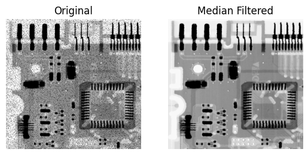

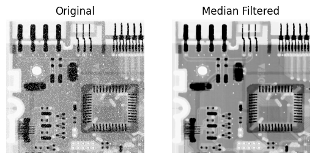

`Q6_1_3.tif` is restored by the adaptive median filter, as shown in Figure todo. The adaptive median filter also traverses through each pixel, so it also has a time complexity of $O(n)$​. However, since it may enlarge the window when processing, the time complexity should be greater than that of the median filter. As for the space complexity, the adaptive median filter needs to store several values like the minimum, maximum, and median value within the window, but that does not scale as the input image gets larger, so the space complexity is also $O(1)$.

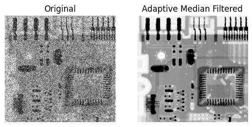

Because the noise density of `Q6_1_3.tif` is too high, applying the median filter is not good enough, as shown in Figure todo.


For `Q6_1_4.tif`, I first apply adaptive median filter to remove the impulse noise (Figure todo), then apply the adaptive mean filter to remove the Gaussian noise (Figure todo).

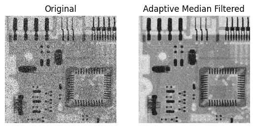

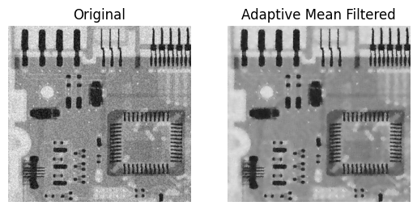

Specifically, the ROI selected (in white box) to estimate the noise variance is shown in Figure todo and todo.

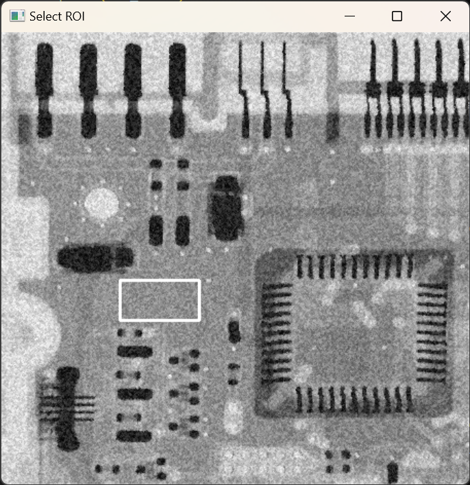

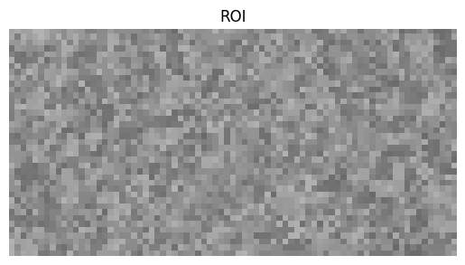

## Restoring Atmospheric Turbulence

For `Q6_2.tif`, the direct inverse filtering result (regulated to 0~255) is shown in Figure todo. In which, the degradation function in frequency domain is shown in Figure todo.

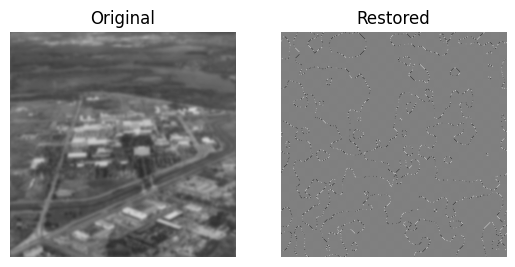

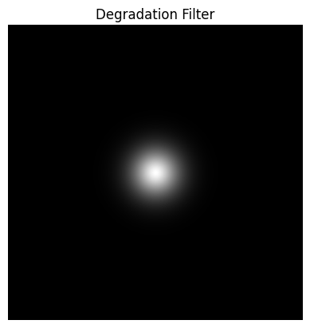

The range of the original pixel values (not regulated) after filtering is 

```python
Max: 1.3185487450217516e+16, Min: -1.3170810031765624e+16
```

which shows that the noise is greatly magnified by this filter.

However, if we do a little bit, adding a constant $0.01$ to the filter like this, we can obtain a clean and clear restored image (Figure todo).

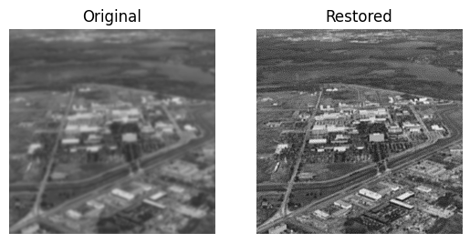

The time complexity of the filter is $O(n)$, because I calculate the inverse filter value one by one. But the time complexity can be easily decreased to 𝑂(1) if we utilize the broadcasting mechanism in `numpy`, which can avoid a double `for` loop.

Another way to avoid the defect of inverse filtering is by using radially limited inverse filtering, however, since Butterworth filter is introduced, we can expect that, if the cut off frequency is too low, the image is further blurred instead of restored, and if the cut off frequency is too high, the defect in inverse filtering will also appear. The result in Figure todo verified this analysis, where $D0$ is the cut off radius.

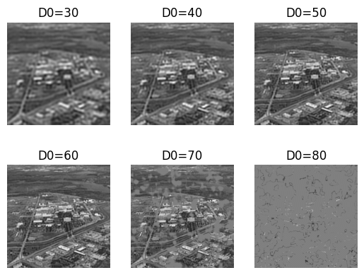

The final and also the best approach I made to restore this image is using Wiener filtering. The result is shown in Figure todo. $K$ is the hyperparameter in the formula:
$$
\hat{F}(u,v)=\left[\frac1{H(u,v)}\frac{|H(u,v)|^2}{|H(u,v)|^2+K}\right]G(u,v)
$$
When $K$ approaches zero, the Wiener filter appears more like a full inverse filter, and when 𝐾 gets larger, the Wiener filter appears more like a lowpass filter.

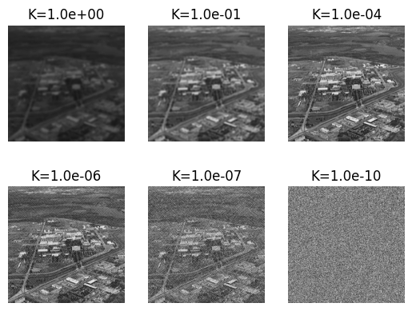

If we compare the result obtained by adding a small constant in full inverse filtering and the Wiener filter with $K=1.0e-04$ as shown in Figure to do, we can notice that the Wiener filter showcases less ring effect.

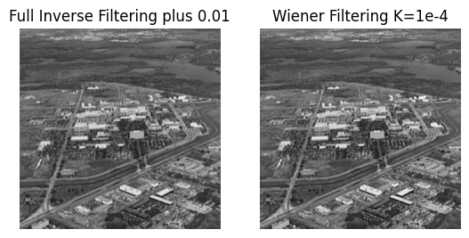

## Restoring Motion Blurred Images

For `Q6_3_1.tif`, I use Wiener filter to restore, the result is shown in Figure todo.

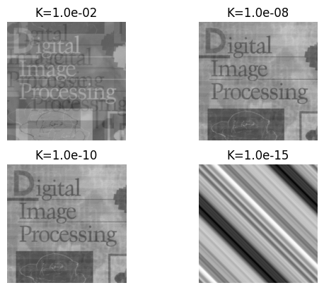

For `Q6_3_2.tif` and `Q6_3_3.tif`, which are strongly distorted by Gaussian noise, I cannot produce a satisfactory result using Wiener filtering, even trying a lot of hyperparameters $K$s. Thus, I resorted to constrained least squares filtering, with different hyperparameters $\gamma$​ in the formula
$$
\hat{F}(u, v) = \frac{H^*(u, v) G(u, v)}{|H(u, v)|^2 + \gamma |P(u, v)|^2}
$$
The results is shown in Figure todo and todo.

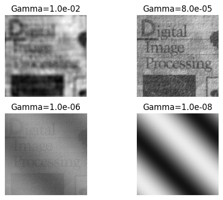

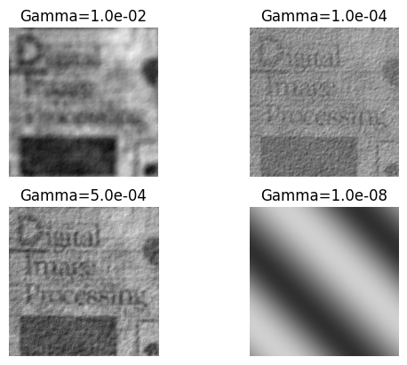

Also, when $\gamma$ is small, the result is more like fully inverse filtering, and when $\gamma$ is large, the result is more like low-pass filtering.

# Conclusion

In this paper, we explored various methods for image restoration, addressing challenges posed by different types of noise and degradation functions. Our experiments demonstrated that while traditional filters like the median and adaptive median are effective against salt and pepper noise, more sophisticated techniques such as adaptive mean filtering, inverse filtering, Wiener filtering, and constrained least squares filtering are required to tackle complex degradations like Gaussian noise, atmospheric turbulence, and motion blur. In our lab experiments, we successfully restored degraded images using various methods: Median and adaptive median filters effectively restored images with salt and pepper noise; a combination of adaptive median and adaptive mean filters addressed images degraded by both salt and pepper and Gaussian noise; for complex issues like atmospheric turbulence or motion blur, we modeled the degradation function and then employed inverse filtering, Wiener filtering, or constrained least squares filtering for effective restoration. In addition, we also prove that full inverse filtering added with a constant can greatly improve the restoration performance and produce comparable results with Wiener filtering.